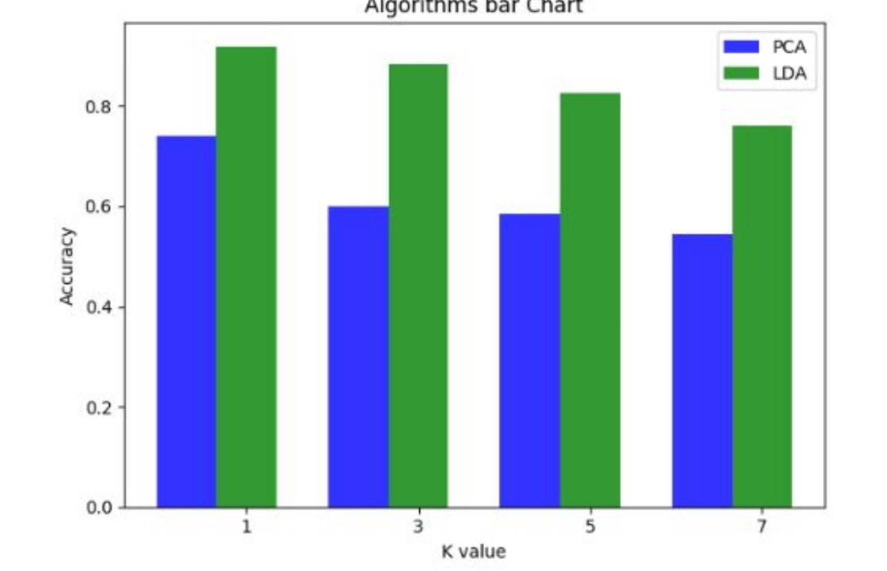
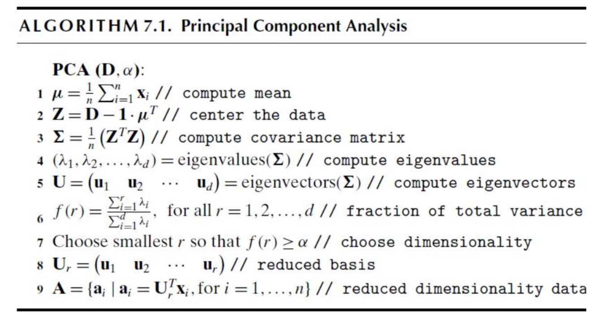
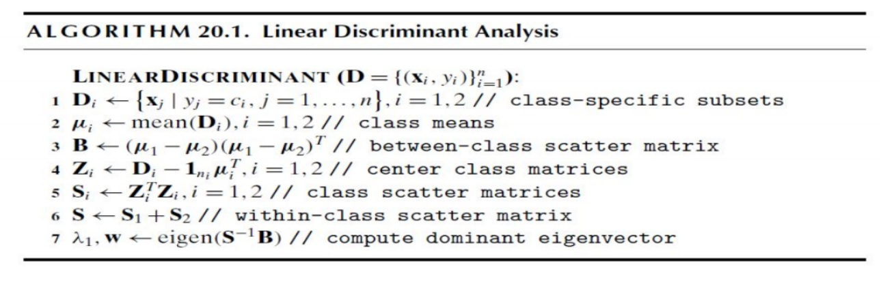
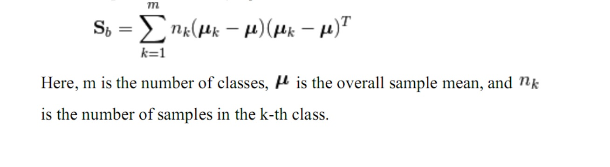

# Face Recognition 
- this is the implmentation of eigenfaces algorithm 
- EigenFaces Algorithm is simply using LDA or PCA for reduce dimension then applying a simple classifier
- We hace used 
- ORL Datasaet has 10 images paer 40 subjects. Every image is a grayscale image of size 92x112.
- there too much graphs in the notebook because It was our first time exploring the field.
- results 
- in this graph you will find that always LDA getting a higher accuracy , and that's expected because LDA is considering the labels 
- PCA Algorithm 
- LDA Algorithm 
- to use LDA for multiclass we must modify it 
	- calculate the mean vector for each class
	- We have modifed B Matrix to Sb 
- refrences
	-  data minning and analysis book(free)
	- [web sitea](http://www.dataminingbook.info/pmwiki.php)

	
