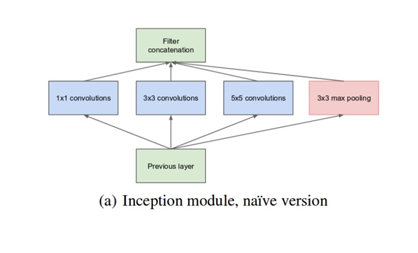
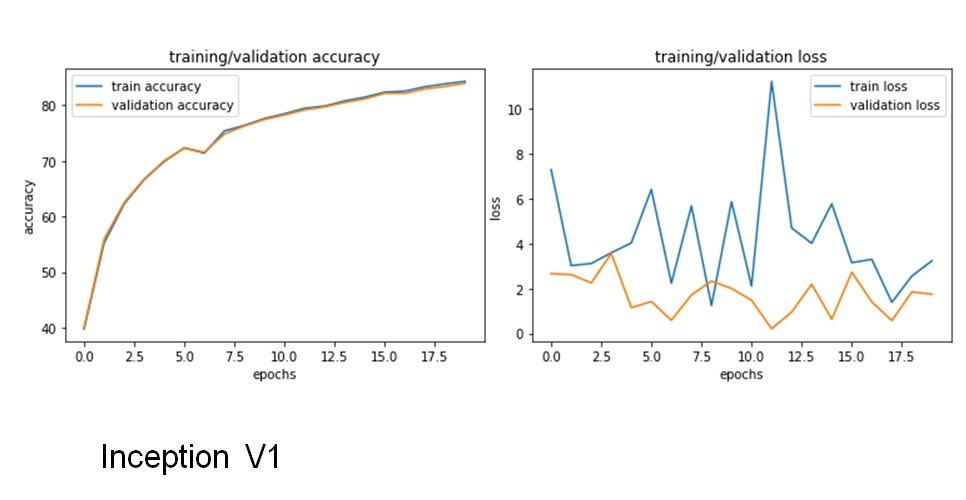
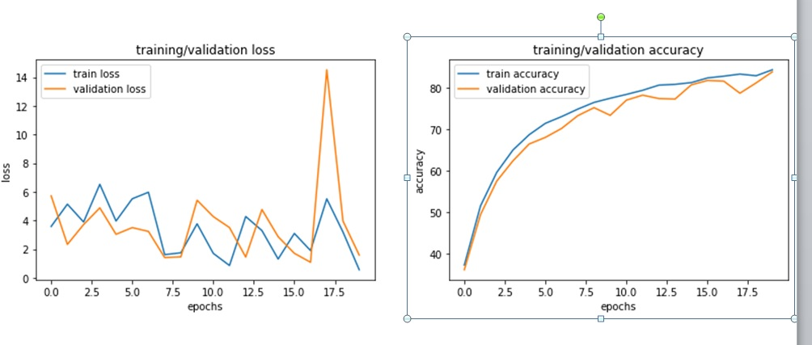

# CIFAR 10 CLassification

 - 	  Simple Project to classify image for cifar dataset
 - we have implemented google net archetchre 
 - We have implemented Inception V1 , V2 
 - all implmentation done in pytorch 
 - We have reached 84% accuracy on validation set 
 - We have reached 80% accuracy on Testing set 
 - No Transfer Learning used 
 - basic inception v1 module architecture
 - They make an advanced verison of it by using 1x1 convolution before 5x5 ,3x3 convolutions layer, this trick make it cheaper and limit the depth of the input .
 - They have noticed that downgrading the image with a large filter loss a lot of information so they replaced v1 5x5 convolution filter by two 3x3 consective convolutions in inception V2
 - Inception is the basic building model of google net architecture
 - training graphs for veriosn 1 
 - training graphs for veriosn 2
 - refrence
 
