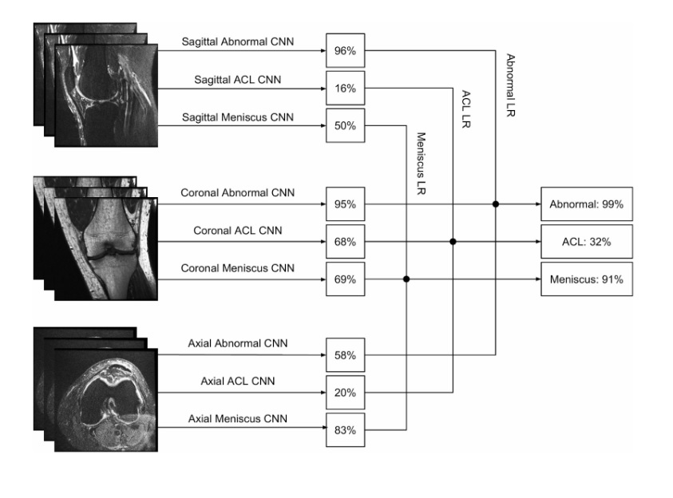

#MRNet

 - The MRNet dataset consists of 1,370 knee MRI exams performed at Stanford University Medical Center. The dataset contains 1,104 (80.6%) abnormal exams, with 319 (23.3%) ACL tears and 508 (37.1%)
 - Mainly this a 3d video classification problem 
 - Every exam cosist of almost 40(not constant) frame from 3 sides 
 - We need to classify the 3 sides to 3 indecation 
 - The best results came from stanford (image) and that's what we want to mimic 
 - We didn't complete it we just made the first level
 - 3 binary problem 3 indecation = 9 deep learning  models 
 - We have used transfer learning to train ResNet 
 - There is no use to of RNN to connect the frames , just make a prediction of each image , label = majority vote
 - Refrence :[link](https://stanfordmlgroup.github.io/competitions/mrnet/)
