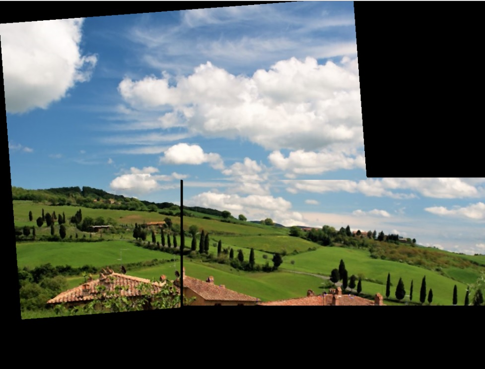
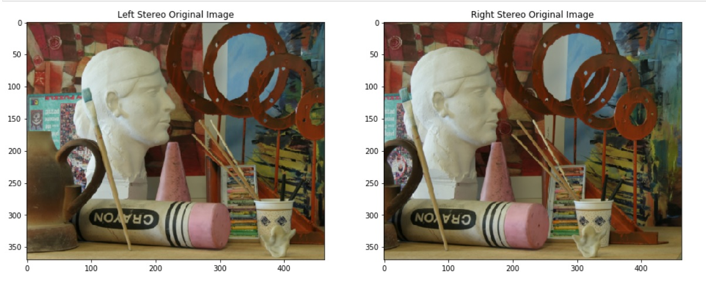
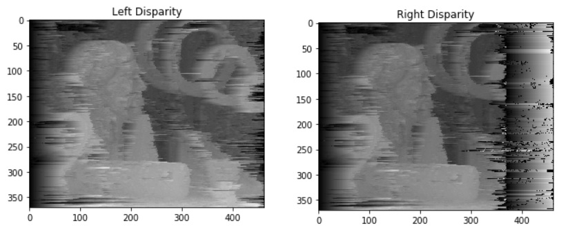

# Computer Vision Projects

	

 - In this repo you will find my computer vision projects
 - **You will find more information and details about each project ,In the readme  of it's directory**(still updating, refactoring )
 - I've mentioned my teammates in each project 
 - **Deep Learning Projects:**
	- 	Image Classification On Cifar:
	-	[Dog Breed Classifier](https://github.com/zeyad3ezzat/DL-Udacity-Nanodegree/tree/master/Projects/dog_bread_classification_CNN)
	- 	MRNet training  :detect most common indecations of knee MRI Examination.
	- 	3d object detection :detect 3d cars using stereo images 
	-	[Generate faces and Digits using GANS](https://github.com/zeyad3ezzat/DL-Udacity-Nanodegree/tree/master/Projects/face_generation_GANs)

- **non-Deep Learning Projects:**
	 - Image Segmentation: using k-means and spectrual clustring to segment each image
	 - Face Recognition :eigenfaces algorithm.
	 - Image Cartoonifier:using simple filter two create cartoon from normal image.
	 - Image Stitcher :creating a panorama image from two images 
	 - Stereo Vision: getting the depth of the image from two images
	
		

	

# Sample of the results
## Dog Breed Classifier

## MRNet
the outline of the model we want to implment 
	  

## 3d object Detection 

## generate images
starting from random image

reaching digits and faces after training 

## Image Segmentation

## Image Cartoonifier

## Image Stitcher 
having input of two image 

result after getting the keypoint and stitching them 

## Stereo Vision 
the input is two image of stereo system  

disparity map generated from them 

