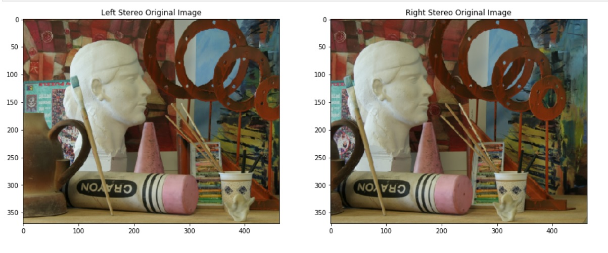

# Depth Image from Stereo Vision System

 - 	Stereo Vision System is a computer vision trial to mimic having two eyes in human
 - Stereo Vision System  has two cameras and the tranformation matrix from one camera to another 
 - We are solving a base-line stereo case so 
 - base-line stereo case is the case where the images taken with a forward facing camera and the translation between cameras is along the horizontal axis .
  - baseline stereo vision 
  

 - three steps needs to be obtained to get the depth
	 - Block Matching 
	 - Calclating the desparity for a row 
	 - apply the same calclation for all rows in the image
 - Block Matching 
	 - We calclated Matched points using Sum of Squared Differences(SSD) or Sum of Absolute Differences(SAD)
	 - We have tried our implmentation and open-CV implmentation 
 - Disparity Calculations 
	 - The term disparity in stereo vision refers to the apparent shift in pixel or motion in a pair of stereo images.
	 - We have calcleted this using dynamic programing
	 - First pixel in the row(SSD measure) calclated using this
		 - sigma is an error measue =2 (you can optimize it)
	 - After this you will use this formula for the rest of the row 
		 - C0 is skipping pixel cost =1 (you can optimize it)
	 - these values saved in D(n x n ) where n is the number of pixels in the row
	 - we use backtracking algorithm 
		 - Starting from tha end D(n x n) location 
		 - Select the smallest between D(i-1,j-1),D(i-1,j),D(i,j-1)
		 - D(i-1,j)=skipping a pixel in left image and increasing disparity by one unit
		 - D(i,j-1)=skipping a pixel in Right image and decreasing disparity by one unit
		 -   D(i-1,j-1)=two pixels in the two image matched (on the same depth) and don't changee disparity
		 - Visulaization of the backtracking 
		 - 
	 - [lecture link](https://web.yonsei.ac.kr/hgjung/Lectures/AUE859/6.%20Stereo%20Matching.pdf)
 - input and output
 
 

- credits
	- [Zeyad Ezzat](https://github.com/zeyad3ezzat)
	- [Mostafa Tohami](https://github.com/tohamybasha)
	- [Mostafa Sheref](https://github.com/tohamybasha)

	
